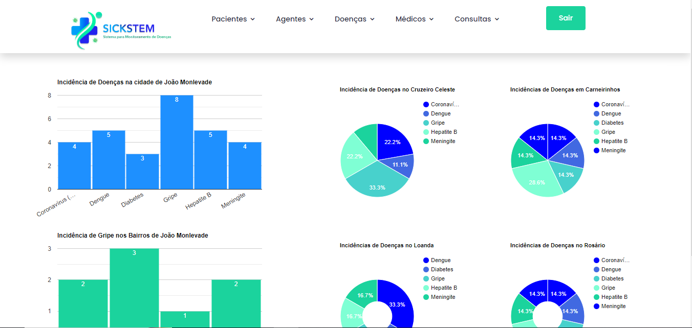

# 🩺 Sickstem - Sistema para Monitoramento de Doenças por Bairro

## 📃 Sobre o Sistema:
O sistema é uma aplicação web dedicada ao monitoramento de incidências de doenças 
por bairro em uma cidade específica. Utiliza dados provenientes de visitas domiciliares 
realizadas por agentes de saúde, bem como consultas médicas em postos de saúde. A 
finalidade principal é identificar e visualizar as prevalências de doenças em diferentes 
bairros, apresentando essas informações por meio de gráficos. O sistema armazena 
dados de agentes de saúde, médicos, pacientes, consultas, visitas e tipos de doenças 
para fornecer uma visão abrangente do panorama de saúde da comunidade.

## 📐 Diagrama Conceitual ER:


## 🧮 Modelo Lógico:


## 📄 Script de Criação do Banco de Dados:
``` sql
 CREATE TABLE IF NOT EXISTS controle_doencas_bairro.Agente (
 CPF VARCHAR(12) NOT NULL,
 Nome VARCHAR(120) NULL,
 Telefone VARCHAR(45) NULL,
Senha VARCHAR(120) NULL,
 PRIMARY KEY (CPF))
ENGINE = InnoDB;
-- -----------------------------------------------------
-- Table controle_doencas_bairro.Paciente
-- -----------------------------------------------------
CREATE TABLE IF NOT EXISTS controle_doencas_bairro.Paciente (
 CPF VARCHAR(12) NOT NULL,
 Nome VARCHAR(120) NULL,
 Data_de_nascimento DATE NULL,
 CEP VARCHAR(45) NULL,
 Sexo VARCHAR(45) NULL,
 Telefone VARCHAR(20) NULL,
 Rua VARCHAR(45) NULL,
 Bairro VARCHAR(45) NULL,
 PRIMARY KEY (CPF))
ENGINE = InnoDB;
Universidade Federal de Ouro Preto
Instituto de Ciências Exatas e Aplicadas
8
-- -----------------------------------------------------
-- Table controle_doencas_bairro.Doença
-- -----------------------------------------------------
CREATE TABLE IF NOT EXISTS controle_doencas_bairro.Doenca (
 Nome VARCHAR(50) NOT NULL,
 Gravidade VARCHAR(45) NULL,
 Classificacao VARCHAR(45) NULL,
 Condicao VARCHAR(45) NULL,
 PRIMARY KEY (Nome))
ENGINE = InnoDB;
-- -----------------------------------------------------
-- Table controle_doencas_bairro.Médico
-- -----------------------------------------------------
CREATE TABLE IF NOT EXISTS controle_doencas_bairro.Medico (
 CRM VARCHAR (15) NOT NULL,
 Nome VARCHAR(120) NULL,
 Especialidade VARCHAR(45) NULL,
 Senha VARCHAR(120) NULL,
 PRIMARY KEY (CRM))
ENGINE = InnoDB;
-- -----------------------------------------------------
-- Table controle_doencas_bairro.Consulta
-- -----------------------------------------------------
CREATE TABLE IF NOT EXISTS controle_doencas_bairro.Consulta (
 Codigo INT NOT NULL,
 Data_Hora DATETIME NULL,
 Medico_CRM VARCHAR(15) NOT NULL,
 PRIMARY KEY (Codigo),
Universidade Federal de Ouro Preto
Instituto de Ciências Exatas e Aplicadas
9
 INDEX fk_Consulta_Medico_idx (Medico_CRM ASC) ,
 CONSTRAINT fk_Consulta_Medico
 FOREIGN KEY (Medico_CRM)
 REFERENCES controle_doencas_bairro.Medico (CRM)
 ON DELETE NO ACTION
 ON UPDATE NO ACTION
 )
ENGINE = InnoDB;
-- -----------------------------------------------------
-- Table controle_doencas_bairro.Detectada
-- -----------------------------------------------------
CREATE TABLE IF NOT EXISTS controle_doencas_bairro.Detectada (
 Doenca_Nome VARCHAR(50) NOT NULL,
 Consulta_Codigo INT NOT NULL,
 PRIMARY KEY (Doenca_Nome, Consulta_Codigo),
 INDEX fk_Doenca_has_Consulta_Consulta1_idx (Consulta_Codigo ASC) ,
 INDEX fk_Doenca_has_Consulta_Doenca1_idx (Doenca_Nome ASC) ,
 CONSTRAINT fk_Doenca_has_Consulta_Doenca1
 FOREIGN KEY (Doenca_Nome)
 REFERENCES controle_doencas_bairro.Doenca (Nome)
 ON DELETE NO ACTION
 ON UPDATE NO ACTION,
 CONSTRAINT fk_Doenca_has_Consulta_Consulta1
 FOREIGN KEY (Consulta_Codigo)
 REFERENCES controle_doencas_bairro.Consulta (Codigo)
 ON DELETE NO ACTION
 ON UPDATE NO ACTION)
ENGINE = InnoDB;
-- -----------------------------------------------------
-- Table controle_doencas_bairro.Visita
Universidade Federal de Ouro Preto
Instituto de Ciências Exatas e Aplicadas
10
-- -----------------------------------------------------
CREATE TABLE IF NOT EXISTS controle_doencas_bairro.Visita (
 Agente_CPF VARCHAR(12) NOT NULL,
 Paciente_CPF VARCHAR(12) NOT NULL,
 Data_Hora DATETIME NULL,
 PRIMARY KEY (Agente_CPF, Paciente_CPF),
 INDEX fk_Agente_has_Paciente_Paciente1_idx (Paciente_CPF ASC) ,
 INDEX fk_Agente_has_Paciente_Agente1_idx (Agente_CPF ASC) ,
 CONSTRAINT fk_Agente_has_Paciente_Agente1
 FOREIGN KEY (Agente_CPF)
 REFERENCES controle_doencas_bairro.Agente (CPF)
 ON DELETE NO ACTION
 ON UPDATE NO ACTION,
 CONSTRAINT fk_Agente_has_Paciente_Paciente1
 FOREIGN KEY (Paciente_CPF)
 REFERENCES controle_doencas_bairro.Paciente (CPF)
 ON DELETE NO ACTION
 ON UPDATE NO ACTION)
ENGINE = InnoDB;
-- -----------------------------------------------------
-- Table controle_doencas_bairro.Tem_doença
-- -----------------------------------------------------
CREATE TABLE IF NOT EXISTS controle_doencas_bairro.Tem_doenca (
 Paciente_CPF VARCHAR(12) NOT NULL,
 Doenca_Nome VARCHAR(50) NOT NULL,
 PRIMARY KEY (Paciente_CPF, Doenca_Nome),
 INDEX fk_Paciente_has_Doenca1_Doenca1_idx (Doenca_Nome ASC) ,
 INDEX fk_Paciente_has_Doenca1_Paciente1_idx (Paciente_CPF ASC) ,
 CONSTRAINT fk_Paciente_has_Doenca1_Paciente1
 FOREIGN KEY (Paciente_CPF)
 REFERENCES controle_doencas_bairro.Paciente (CPF)
Universidade Federal de Ouro Preto
Instituto de Ciências Exatas e Aplicadas
11
 ON DELETE NO ACTION
 ON UPDATE NO ACTION,
 CONSTRAINT fk_Paciente_has_Doenca1_Doenca1
 FOREIGN KEY (Doenca_Nome)
 REFERENCES controle_doencas_bairro.Doenca (Nome)
 ON DELETE NO ACTION
 ON UPDATE NO ACTION)
ENGINE = InnoDB;
-- -----------------------------------------------------
-- Table controle_doencas_bairro.Faz_consulta
-- -----------------------------------------------------
CREATE TABLE IF NOT EXISTS controle_doencas_bairro.Faz_consulta (
 Paciente_CPF VARCHAR(12) NOT NULL,
 Consulta_Codigo INT NOT NULL,
 PRIMARY KEY (Paciente_CPF, Consulta_Codigo),
 INDEX fk_Paciente_has_Consulta_Consulta1_idx (Consulta_Codigo ASC) ,
 INDEX fk_Paciente_has_Consulta_Paciente1_idx (Paciente_CPF ASC) ,
 CONSTRAINT fk_Paciente_has_Consulta_Paciente1
 FOREIGN KEY (Paciente_CPF)
 REFERENCES controle_doencas_bairro.Paciente (CPF)
 ON DELETE NO ACTION
 ON UPDATE NO ACTION,
 CONSTRAINT fk_Paciente_has_Consulta_Consulta1
 FOREIGN KEY (Consulta_Codigo)
 REFERENCES controle_doencas_bairro.Consulta (Codigo)
 ON DELETE NO ACTION
 ON UPDATE NO ACTION)
ENGINE = InnoDB;
``` 
Para visualizar os scripts de povoamento e os determinados requisitos do sistema, vá para a pasta [Documentação](Documentação).


## 👩‍💻 Ferramentas Necessárias para o Funcionamento do Sistema:

[](https://www.php.net/)

[](https://getbootstrap.com/)

[](https://www.apachefriends.org/index.html)

[](https://developer.mozilla.org/en-US/docs/Web/JavaScript)

[](https://www.mysql.com/)

## 🖥️ Conheça nosso sistema:





## ✍️ Autores:

 - [Mateus Henrique dos Santos](https://github.com/MateusSaantos)
 - [Emanuelle Ferraz Lima](https://github.com/emanuelleferraz)
 - [Esdras Almeida Ávila](https://github.com/Ezra2323)

## 📲 Contato:
- mateus_saantos@outlook.com
- emanuelle.ferrazlm@gmail.com
- acaavila@gmail.com


